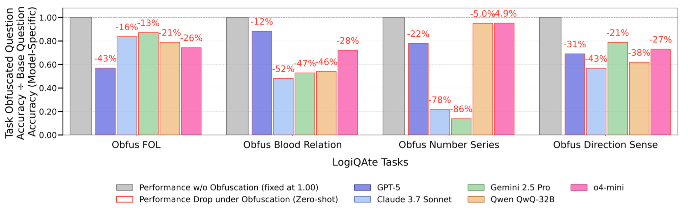

# Don’t Judge a Book by Its Cover: Testing LLMs’ Robustness Under Logical Obfuscation


**Dataset (LogiQAte) Link:** [https://huggingface.co/datasets/abhilekhborah/LogiQAte](https://huggingface.co/datasets/abhilekhborah/LogiQAte)


## Overview


LogiQAte is the first-ever logical obfuscation diagnostic benchmark, created using our proposed Logifus obfuscation method introduced in the paper, across four reasoning types.


Published in:
> Proceedings of the 19th Conference of the European Chapter of the Association for Computational Linguistics (EACL 2026)

This benchmark is designed to evaluate whether large language models (LLMs) truly reason or merely rely on surface pattern matching.

## Performance of SoTA LLMs




---

If you use LogiQAte, please cite:

```bibtex
@inproceedings{borah2026logiqate,
	title     = {Don’t Judge a Book by its Cover: Testing LLMs’ Robustness Under Logical Obfuscation},
	author    = {Borah, Abhilekh and Ghosh, Shubhra and Joshi, Kedar and Guru, Aditya Kumar and Ghosh, Kripabandhu},
	booktitle = {Proceedings of the 18th Conference of the European Chapter of the Association for Computational Linguistics (EACL)},
	year      = {2026}
}
```


